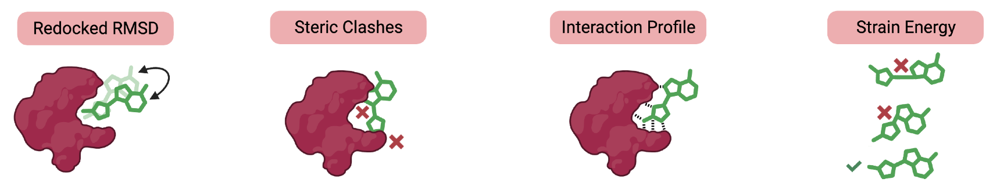

# PoseCheck: Benchmarking Generated Poses


[](https://arxiv.org/abs/2308.07413)

[](https://github.com/pre-commit/pre-commit)
[](https://github.com/cch1999/posecheck/actions/workflows/tests.yaml)
[](https://www.repostatus.org/#active)
[](https://opensource.org/licenses/MIT)

<p align="center">
  <a href="">
    
  </a>
</p>

 [Paper](https://arxiv.org/abs/2308.07413) | Documentation [WIP]

## What is PoseCheck?

PoseCheck is a package for analysing the quality of generated protein-ligand complexes from 3D target-condtioned generative models.

<!-- # ## Why use PoseCheck?
#
#
#
# <p align="center">
#   <a href="https://www.graphein.ai/#gh-light-mode-only">
#     
#   </a>
# </p> -->

## Installation

```bash
git clone https://github.com/cch1999/posecheck.git
cd posecheck

pip install -e .
pip install -r requirements.txt
conda install -c mx reduce
```

Optional

```
conda install -c conda-forge openbabel
```

## Example useage

We provide a simple top level API to easily interact with the whole of the benchmark. Just define the `PoseCheck` object once at the top of your existing testing code and test molecules by loading them in iteratively. You can also use all the testing fuctions manually as well (see Docs for more info).

```python
from posecheck import PoseCheck

# Initialize the PoseCheck object
pc = PoseCheck()

# Load a protein from a PDB file (will run reduce in the background)
pc.load_protein_from_pdb("data/examples/1a2g.pdb")

# Load ligands from an SDF file
pc.load_ligands_from_sdf("data/examples/1a2g_ligand.sdf")
# Alternatively, load RDKit molecules directly
# pc.load_ligands_from_mol(rdmol)

# Check for clashes
clashes = pc.calculate_clashes()
print(f"Number of clashes in example molecule: {clashes[0]}")

# Check for strain
strain = pc.calculate_strain_energy()
print(f"Strain energ of example moleculey: {strain[0]}")

# Check for interactions
interactions = pc.calculate_interactions()
print(f"Interactions of example molecule: {interactions}")
```

## Tips

- We use [reduce](https://github.com/rlabduke/reduce) for adding hydrogens to proteins. The default executable path is `reduce` but you can change this using `PoseCheck(reduce_path = "/path/to/reduce")`

- Reading and processing all the PDB files using `reduce` can take a while for a large test set. If you are running `PoseCheck` frequently, it might be worth pre-processing all proteins yourself using `prot = posecheck.utils.loading.load_protein_from_pdb(pdb_path)` and setting this directly within `PoseCheck` using `pc.protein = prot`.

## Data from the paper


The data for the paper can be found at the following Zenodo link and place in the `data` directory.

[](https://doi.org/10.5281/zenodo.10208912)


## Cite

```bibtex
@article{harris2023benchmarking,
  title={Benchmarking Generated Poses: How Rational is Structure-based Drug Design with Generative Models?},
  author={Harris, Charles and Didi, Kieran and Jamasb, Arian R and Joshi, Chaitanya K and Mathis, Simon V and Lio, Pietro and Blundell, Tom},
  journal={arXiv preprint arXiv:2308.07413},
  year={2023}
}
```

## Acknowledgements

PoseCheck relies on several other codebases to function. Here are the links to them:

- [RDKit](https://github.com/rdkit/rdkit): A collection of cheminformatics and machine learning tools.
- [ProLIF](https://github.com/chemosim-lab/ProLIF): Protein-Ligand Interaction Fingerprints generator.
- [Seaborn](https://github.com/mwaskom/seaborn): Statistical data visualization library.
- [NumPy](https://github.com/numpy/numpy): The fundamental package for scientific computing with Python.
- [DataMol](https://github.com/datamol-org/datamol): A minimalist and practical chemoinformatics library for python.
- [Pandas](https://github.com/pandas-dev/pandas): Powerful data structures for data analysis, time series, and statistics.
- [Reduce](https://github.com/rlabduke/reduce): A program for adding hydrogens to a Protein DataBank (PDB) molecular structure file.

There is also the similar package [PoseBusters](https://github.com/maabuu/posebusters) which provides additional tests to us and is recommended if you are benchmarking protein-ligand docking models.
